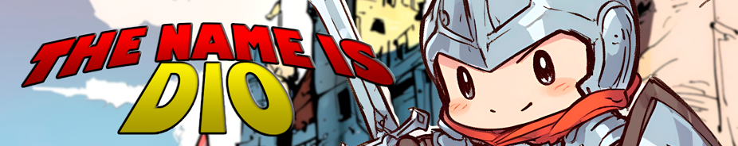

<!-- Improved compatibility of back to top link: See: https://github.com/othneildrew/Best-README-Template/pull/73 -->

<!--
*** Thanks for checking out the Best-README-Template. If you have a suggestion
*** that would make this better, please fork the repo and create a pull request
*** or simply open an issue with the tag "enhancement".
*** Don't forget to give the project a star!
*** Thanks again! Now go create something AMAZING! :D
-->

<!-- PROJECT SHIELDS -->
<!--
*** I'm using markdown "reference style" links for readability.
*** Reference links are enclosed in brackets [ ] instead of parentheses ( ).
*** See the bottom of this document for the declaration of the reference variables
*** for contributors-url, forks-url, etc. This is an optional, concise syntax you may use.
*** https://www.markdownguide.org/basic-syntax/#reference-style-links
-->
[![Contributors][contributors-shield]][contributorS-url]
[![Forks][forks-shield]][forks-url]
[![Stargazers][stars-shield]][stars-url]
[![Issues][issues-shield]][issues-url]
[![MIT License][license-shield]][license-url]
[![LinkedIn][linkedin-shield]][linkedin-url]

<!-- PROJECT LOGO -->
 

  

  

    <b>The Name is Dio</b> is an open-sourced survival/action game prototype made using Godot Engine. 
The main goal is to survive for 20 minutes. Second goal is to collect as many loot as you can and get higher points. 
     
  

  

   <a href="https://rmlz.itch.io/the-name-is-dio"><strong>Play at itch.io »</strong></a>
     
       
  

<!-- TABLE OF CONTENTS -->

  
Table of Contents

  <ol>
    <li>
      <a href="#about-the-project">About The Project</a>
      <ul>
        <li><a href="#built-with">Built With</a></li>
      </ul>
    </li>
    <li><a href="#usage">Usage</a></li>
    <li><a href="#roadmap">Roadmap</a></li>
    <li><a href="#contributing">Contributing</a></li>
    <li><a href="#license">License</a></li>
    <li><a href="#contact">Contact</a></li>
    <li><a href="#acknowledgments">Acknowledgments</a></li>
  </ol>

<!-- ABOUT THE PROJECT -->
## About The Project

[![Product Name Screen Shot][product-screenshot]](https://example.com)

This project was started to learn more about Godot Engine and to create a simple game. 
The game is a prototype and is open for anyone who wants to learn more about Godot Engine. 
It is a simple action game where the player must survive the most they can, and gets
some inspiration from the game "Vampire Survivors".

The code is open for anyone who wants to learn more of Godot. 
You also may create your own game respecting the Mozilla licence set up for this project.

(<a href="#readme-top">back to top</a>)

### Built With

* [![godot][godot-shield]][godot-url]

(<a href="#readme-top">back to top</a>)

<!-- ROADMAP -->
## Roadmap
### What is new?
- Version 0.0.7
  - [x] DIO-23 Adds sword reach amplifier buff
  - [x] DIO-24 Adds new dash skill
  - [x] DIO-25 Implements new audio logics to improve sound effects
  - [x] DIO-26 Improves UI by accepting keyboard and controller commands
  - [x] DIO-27 Adds new enemy: Big Archer
  - [x] DIO-28 Adds timer to collect collectables in the map before it vanishes
  - [x] Adds map music "The name is Dio theme" by Andre Neves

### What is next?
  - [ ] Add new map features

### Previous versions

- VersioN 0.0.6
  - [x] DIO-17 Creates buying system for player's skills
  - [x] DIO-18 Adds pause button
  - [x] DIO-19 Adds new "wind" skill
  - [x] DIO-20 Adds two new buff skills
  - [x] DIO-21 Improves shield skiils from 1 to 3 seconds duration
  - [X] DIO-22 Creates new Enemy: Goblin Barrel

- VersioN 0.0.5
  - [x] DIO-12 Create first ANDROID version of the game
  - [x] DIO-13 Players can submit their scores to a ranking board
  - [x] DIO-14 Fix issue with the mobile joypad not properly handling touch with two fingers
  - [x] DIO-15 Add first sound effects to the game
  - [x] DIO-16 Add new shield magic to player

- Version 0.0.4
  - [x] DIO-9 Reworks how enemy stats are set up
  - [x] DIO-10 Improve dynamite animation quality
  - [x] DIO-11 Animate collectable on map

- Version 0.0.3
  - [x] DIO-5 Reworked player node and mobile ui touch screen
  - [x] DIO-6 Reworks enemies and adds new enemy: Bow and Arrow
  - [x] DIO-7 Adds status ailments (Freeze and Poison) to enemies and a new Magic
    skill avilabla after 5 minutes of gameplay.
  - [x] DIO-8 Reworks the map ta make it easy to update for new versions

- Version 0.0.2
  - [x] Dio-1 Implements mobile-pad for touch screen devices
  - [x] Dio-2 rebuild EnemyBase implementation to handle ranged attacks
  - [x] Dio-3 rebuild EnemyBase into different composition nodes
  - [x] Dio-4 Reworks enemies, animations, mobspawner and time-lapse

- Version 0.0.1
  - [x] Create first playable version

<!--See the [open issues](https://github.com/othneildrew/Best-README-Template/issues) for a full list of proposed features (and known issues).-->

(<a href="#readme-top">back to top</a>)

<!-- CONTRIBUTING -->
# Do you want to contribute?

## Contributing to the code
Contributions are what make the open source community such an amazing place to learn, inspire, and create.
Any contributions you make are **greatly appreciated**. 

Follow the steps below.

1. Fork the Project
2. Create your Feature Branch (`git checkout -b feature/AmazingFeature`)
3. Commit your Changes (`git commit -m 'Add some AmazingFeature'`)
4. Push to the Branch (`git push origin feature/AmazingFeature`)
5. Open a Pull Request

## Contributing with assets and Ideas

If you want to contribute with assets and ideas, please contact me at [Linkedin](https://www.linkedin.com/in/ramon-pinto-de-barros-a4527a72/), or
at [The Name is Dio Itch.io page](https://rmlz.itch.io/the-name-is-dio).

(<a href="#readme-top">back to top</a>)

<!-- LICENSE -->
## License

Distributed under the Mozilla Public License Version 2.0 License. See `LICENSE.txt` for more information.

(<a href="#readme-top">back to top</a>)

<!-- CONTACT -->
## Contact

Ramon Barros - [Linkedin](https://www.linkedin.com/in/ramon-pinto-de-barros-a4527a72/)

Project Link: [https://github.com/rmlz/TheNameIsDio](https://github.com/rmlz/TheNameIsDio)

Play at Itch.io: [https://rmlz.itch.io/the-name-is-dio](https://rmlz.itch.io/the-name-is-dio)

(<a href="#readme-top">back to top</a>)

<!-- ACKNOWLEDGMENTS -->
## Acknowledgments

This project was completed in fulfillment of the requirements for the
[Santander 2024 - Criando Jogos com Godot course offered by Dio.me](https://dio.me/).

(<a href="#readme-top">back to top</a>)

<!-- MARKDOWN LINKS & IMAGES -->
<!-- https://www.markdownguide.org/basic-syntax/#reference-style-links -->
[contributors-shield]: https://img.shields.io/github/contributors/rmlz/TheNameIsDio
[contributors-url]: https://github.com/rmlz/TheNameIsDio/graphs/contributors
[forks-shield]: https://img.shields.io/github/forks/rmlz/TheNameIsDio
[forks-url]: https://github.com/rmlz/TheNameIsDio/network/members
[stars-shield]: https://img.shields.io/github/stars/rmlz/TheNameIsDio.svg?style=for-the-badge
[stars-url]: https://github.com/rmlz/TheNameIsDio/stargazers
[issues-shield]: https://img.shields.io/github/issues/rmlz/TheNameIsDio.svg?style=for-the-badge
[issues-url]: https://github.com/rmlz/TheNameIsDio/issues
[license-shield]: https://img.shields.io/github/license/rmlz/TheNameIsDio.svg?style=for-the-badge
[license-url]: https://github.com/rmlz/TheNameIsDio/blob/master/LICENSE.txt
[linkedin-shield]: https://img.shields.io/badge/-LinkedIn-black.svg?style=for-the-badge&logo=linkedin&colorB=555
[linkedin-url]: https://www.linkedin.com/in/ramon-pinto-de-barros-a4527a72/
[product-screenshot]: readme-files/images/screenshots.png
[godot-url]: https://godotengine.org/
[godot]: https://godotengine.org/
[godot-shield]: https://img.shields.io/badge/GODOT-%23FFFFFF.svg?style=for-the-badge&logo=godot-engine
